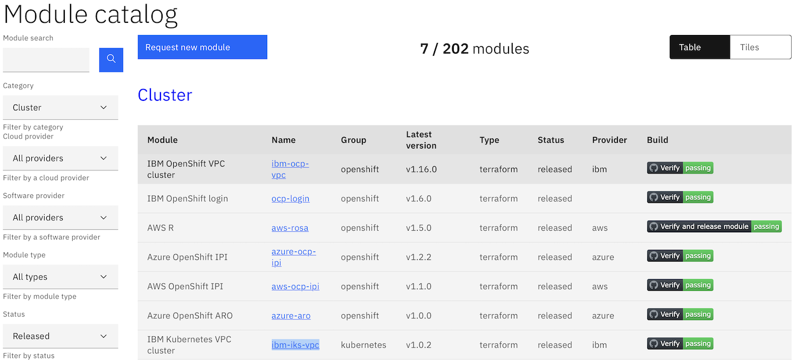

# Module concepts

## What is a module?

A Toolkit module represents a bundle of automation that delivers a defined outcome, wrapped with metadata.

Breaking down complex environment setup steps into small modules, allows better testing and reuse of individual modules.  

A module should follow the [**Separation of Concerns** design principle](https://en.wikipedia.org/wiki/Separation_of_concerns){target=_blank}, where each module is well defined and addresses a single *concern* or task without overlapping with the functionality of other modules.

A [Bill of Materials](./bom.md) is used to combine the automation provided by Toolkit modules to create a desired environment. *The modules are the building blocks and the Bill of Materials are the instructions on how to combine the building blocks to create the desired outcome*

The automation used in the toolkit is based on [Terraform](https://www.terraform.io){target=_blank}, but the module metadata and tooling provided by the Toolkit ensures that the end user of the Toolkit does not need to know how to use Terraform and does not get exposed to the underlying Terraform automation.

There are currently 2 flavours of Toolkit module:

-   Terraform module
-   GitOps module

Both flavours of module use Terraform, but a Terraform module uses Terraform to implement the required automation steps, whilst the GitOps modules use Terraform to make changes to the GitOps source control repository, then the GitOps application, [ArgoCD](https://argo-cd.readthedocs.io){target=_blank}, will actually make the required changes based on the content of the source control repository.  See the [GitOps concept page](gitops.md) for more details.

## How does a module work?

The Toolkit adds a layer of abstraction over the underlying Terraform automation to allow modules to be combined to define a required computing environment, typically a cloud based environment.  The modules are combined using a [Bill of Material](bom.md) yaml file.

The Toolkit layer of abstraction includes:

-   **module data** : a set of properties, including the module a name, ID, a description of what the module does, the platform where the module can run and if the module is a terraform or GitOps module
-   **configuration** : a set of properties that controls the output of the module.  This allows a module to be configured to perform its task in a specific way.  E.g. when installing software on a Kubernetes cluster, you may want to specify the namespace where the software is installed when the module is run rather than hard coding the namespace into the module automation
-   **dependencies** : modules that must be run before this module can perform its work

### Configuration

A module can specify a set of input and output properties.  

The input properties allow the functionality of the module automation to be customized at run time.

The output properties allow a module to make information it generates available to subsequent modules, such as a password generated during an application install.

There is more detail about how properties are used in the Toolkit on the [properties concepts page](variables.md).

### Dependencies

A module may need other modules to have completed their automation tasks before it can perform its own task.  The Toolkit provides a way to allow a module to specify a set of other modules as dependencies.  This ensures modules run in the correct order.  

The dependency system also allows output properties of previously run modules to be linked to the input properties of a module.

### Interfaces

Some modules can result in similar outcomes, such as installing an OpenShift cluster.  The modules all result in a running OpenShift cluster, but they may be on different cloud providers or on bare metal systems.  This can cause an issue if a module wants to specify an OpenShift cluster as a dependency, as which of the many modules that provide an OpenShift cluster should be specified as the dependency?

To overcome this challenge, the Toolkit allows **interfaces** to be defined that specify a set of output properties that must be produced by any module that implements the interface.

A module can specify an interface as a dependency rather than a specific module.

An example of an interface is a [**cluster**](https://github.com/cloud-native-toolkit/software-everywhere/blob/main/interfaces/cluster.yaml){target=_blank}.  Looking at the cluster section of the [module catalog](https://modules.cloudnativetoolkit.dev){target=_blank}, you see there are 7 modules that provide a cluster.  Actually there are 6 modules that will install a cluster and the `IBM OpenShift Login` module that allows you to use an existing cluster.

More details about how a module is implemented can be found in the [module reference](../reference/module.md) section.

## Catalog

A module needs to be included in a catalog for it to be available to a Bill of Material. There is a default [module catalog](https://modules.cloudnativetoolkit.dev){target=_blamk} provided by the Toolkit, and there is a defined process to add new modules to the catalog.  

However, there may be circumstances where modules may need to stay private, so a private module catalog will be needed.  A collection of modules may be managed outside the Toolkit community, but be publicly available in a separate module catalog.  The Toolkit tooling allows modules from multiple catalogues to be used.

!!! Todo
    Add link to the instructions for adding new module to Toolkit catalog in section above

    -   Does the builder UI allow multiple catalogues to be used?

!!! Todo
    Add links to reference pages for BOM and Module + links to the appropriate tasks and tutorials for concepts covered on this page
